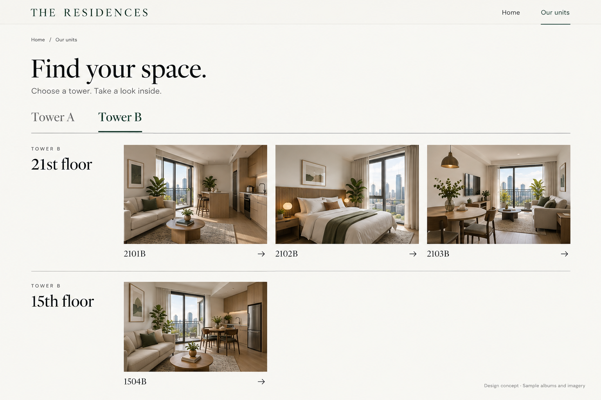
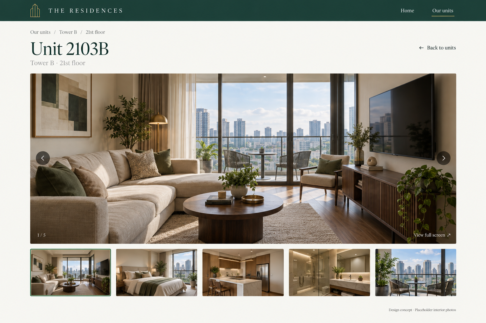

# Unit Page

A public condo photo showcase for browsing units before an in-person viewing.

## Current status

Working static website built with Vite and vanilla JavaScript. Includes a landing page, tower/floor directory, unit albums, thumbnail navigation and a full-window photo viewer. No database or server is required.

## GitHub Pages

The workflow in `.github/workflows/deploy-pages.yml` tests and builds the site, then publishes only `dist/` on pushes to `main`. Pull requests run the checks without publishing.

Repository **Settings → Pages → Build and deployment → Source** must be **GitHub Actions**. Do not select the root of `main` as a branch source: that serves the development HTML without compiling its JavaScript and CSS, resulting in a blank page with only “Skip to content.”

Live address: https://haacchhii.github.io/Unit-Page/

The build checks both catalog images and the generated HTML's bundle paths under `/Unit-Page/`. To roll back a faulty release, revert its commit on `main`; the workflow rebuilds and republishes that version.

## Run locally

Requires Node.js 22.12+ and npm.

```sh
npm ci
npm run dev
```

Open the local URL printed by Vite. `npm test` checks unit parsing, catalog validation and gallery indexing. `npm run build` verifies every referenced image exists and creates `dist/`. `npm run preview` serves that production build.

Routes use URL fragments, so links such as `#/units/2103B` work on static hosting without rewrite rules. Relative asset paths support hosting under a subdirectory such as GitHub Pages. Deploy only `dist/`, not the repository or original photos.

## Add or replace photographs

1. Keep full-resolution originals in a separate backup. Optional local `photo-originals/` is ignored by Git; this is not itself a backup.
2. Name source files descriptively, for example `living-room.jpg`, `bedroom.jpg` and `kitchen.jpg`.
3. Run `npm run photos -- 2103B "C:/path/to/originals"`. This writes optimized full-size WebP files and 640px thumbnails into `public/units/2103B/`. It preserves aspect ratio, rotates based on orientation, strips embedded metadata by default, and refuses existing filenames to avoid accidental replacement. For an update, use a new filename such as `living-room-v2.jpg` and point the catalog to it.
4. Edit `src/catalog.json`. Each unit has an `id`, a `sample` flag, and an ordered `photos` list. Each photo has a filename stem (`file`), readable `caption` and descriptive `alt` text. The first photo is the album cover. Paths are derived centrally by `src/catalog.js`.
5. Set a unit's `sample` flag to `false` only when its entire album contains the owner's real photographs. Set the global `preview` flag to `false` after replacing the temporary business identity and hero imagery. Update `hero.src` and `hero.alt` when replacing the hero.
6. Run `npm test` and `npm run build`, review the result, then redeploy. Keep old assets until the updated catalog is deployed; remove unused files separately when ready.

The two example albums intentionally reuse three generated interiors. They demonstrate navigation, not actual differences between those units. No other units or availability are invented.

## Implementation details

- `src/catalog.json`: the single content catalog; no photo filenames embedded in page components.
- `public/units/<unit-number>/`: optimized photographs and thumbnails tracked in Git.
- `src/main.js`: landing page, directory and shareable album routing.
- `src/gallery.js`: photo navigation, touch swipes and native modal viewer with Escape/focus handling.
- `src/styles.css`: shared green/ivory theme and responsive layouts. Google Fonts enhance the typography; local serif/sans-serif fallbacks keep it usable without font-network access.
- `scripts/prepare-photos.mjs`: repeatable image preparation; originals are never modified.

Later, `photoPath()` can point to external image storage while retaining the same catalog and page layout.

The first version focuses on photographs, with units organized by Tower A or B and floor. Actual unit identifiers are displayed: `2103B` means Tower B, floor 21, unit 03; `1504A` means Tower A, floor 15, unit 04.

## Design concepts

The working name **The Residences** and generated interior photographs are placeholders. Sample albums are not a verified inventory or a statement of availability.

### Landing page


### Unit directory



### Photo album



See [design direction](design/condo-gallery-direction.md) for scope and interaction intent, and [generation prompts](design/prompts.md) for the original image briefs.

## First version scope

- Public landing page and unit photo albums.
- Approximately 55–60 units across two towers, populated from the owner's supplied inventory and photographs.
- Tower and floor organization, real unit numbers, large photographs, thumbnail navigation and full-screen viewing.
- Laptop and mobile layouts.

Prices, availability tracking, bookings, payments, customer accounts and additional locations are deferred.
